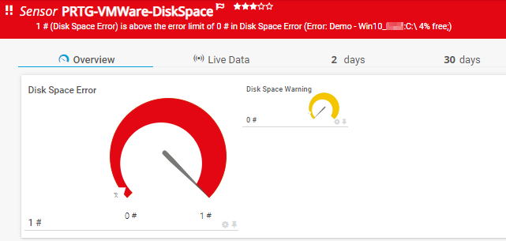

# PRTG-VMware-Diskspace
## Project Owner:

Jannos-443

## Project Details
  VMWare VM disk space monitoring

  Using VMware PowerCLI this Script checks VMware disk space
  Exceptions can be made within this script by changing the variable $IgnoreScript. This way, the change applies to all PRTG sensors 
  based on this script. If exceptions have to be made on a per sensor level, the script parameter $IgnorePattern can be used.

## HOW TO

1. Make sure the VMware PowerCLI Module exists on the Probe under the Powershell Module Path
   - `C:\Program Files\WindowsPowerShell\Modules\VMware.VimAutomation.Core`

2. Place `PRTG-VMware-Snapshot-Age.ps1` under `C:\Program Files (x86)\PRTG Network Monitor\Custom Sensors\EXEXML`

3. Create new Sensor

   | Settings | Value |
   | --- | --- |
   | EXE/Script | PRTG-VMware-DiskSpace.ps1 |
   | Parameters | -ViServer 'yourVCenter' -User 'yourUser' -Password 'yourPassword' |
   | Scanning Interval | 30 minutes |

4. Set the "$IgnorePattern" or "$IgnoreScript" parameter to Exclude VM disks

## Examples
Example Call: 

`PRTG-VMware-Snapshot.ps1 -ViServer '%VCenter%' -User '%Username%' -Password '%PW%' -IgnorePattern '^(FileSVR1:C:\\)$'`

Double \ is needed because you have to escaped the \ in C:\

    Example1:
    exclude "C:\" from the VM "FileSVR1"
    -IgnorePattern '^(FileSVR1:C:\\)$'

    Example2:
    exclude "C:\" from the VM "FileSVR1" and "/" (root) from a linux VM "LinuxVM"
    -IgnorePattern '^(FileSVR1:C:\\|LinuxVM:/)$'

    Example3:
    example2 and exlude all disk from VM "TestSVR23"
    -IgnorePattern '^(FileSVR1:C:\\|LinuxVM:/|TestSVR23.*)$'

VM exceptions
------------------
For more information about regular expressions in PowerShell, visit [Microsoft Docs](https://docs.microsoft.com/en-us/powershell/module/microsoft.powershell.core/about/about_regular_expressions).

".+" is one or more charakters
".*" is zero or more charakters
